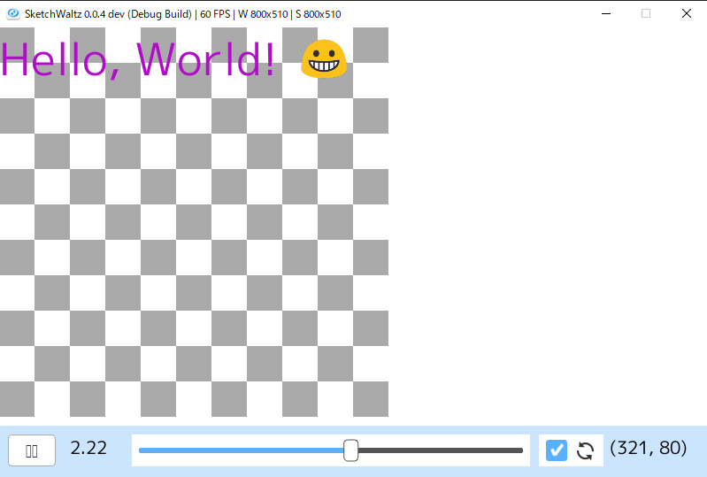

# ClipScript
ClipScriptは短い動画を簡単に作成するためのスクリプト言語です。時間と連動して文字や図形、画像やアニメーションを動かす処理が記述しやすいように設計されています。作成したプログラムは一時停止、逆再生ができます。

ホットリロードに対応しているため素早くイテレーションできます。また画像やgifアニメのようなクリップ素材を変更せずにサイズ(幅と高さ)、色、再生レートの調整が可能です。

## サンプルコード


```ruby
require 'clip'

App.window_size(400, 225)

font = Font.new(60)
smile = Texture.new(Emoji.new("😀"))

script do |root|
  Drawer.background "white"

  (0..10).each do |x|
    (0..10).each do |y|
      if (x + y) % 2 == 0
        root.rect(x * 40, y * 40, 40, 40, color: "gray")
        root.wait 0.02
      end
    end
  end
end  

script do |root|
  t = root.text(font, 0, 0, color: "black", text: "Hello, ")
  root.wait 0.2

  t.text += "W"
  root.wait 0.2

  t.text += "o"
  root.wait 0.2

  t.text += "r"
  root.wait 0.2

  t.text += "l"
  root.wait 0.2

  t.text += "d"
  root.wait 0.2

  t.text += "!"
  root.until_time 2

  x = root.texture(smile, 180, 100)
  x.scale(0.4, 0.4)
end

App.run
```

## スクリーンショット


